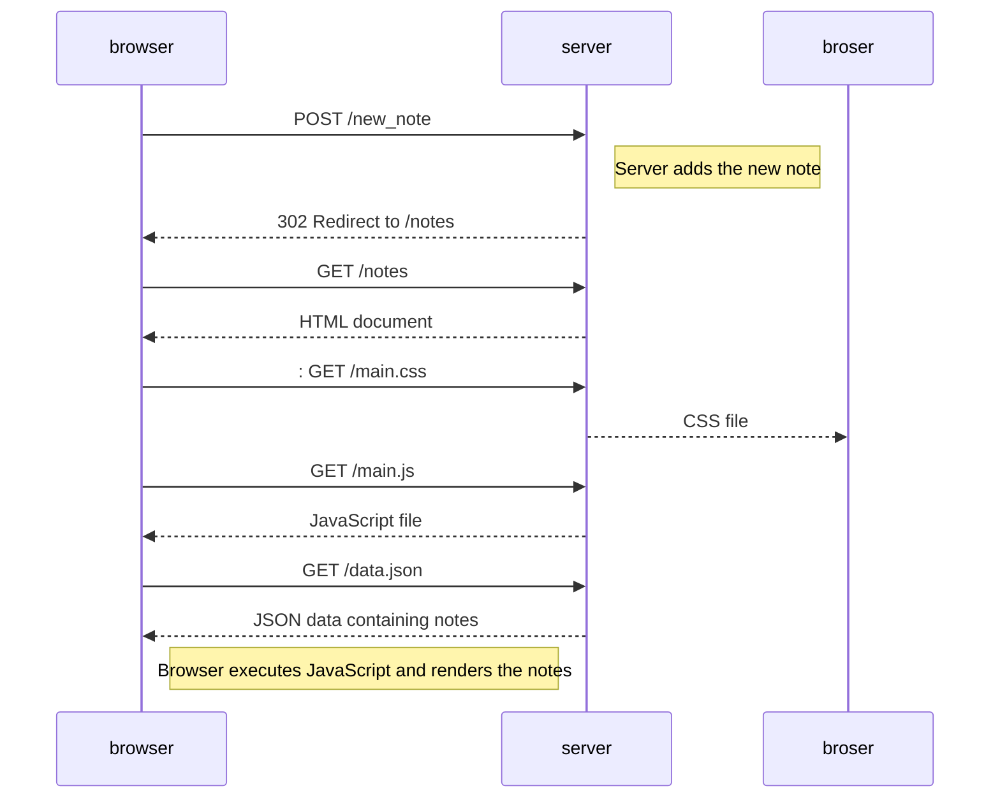

```mermaid
sequenceDiagram
    participant browser
    participant server

    browser->>server: POST /new_note

    Note right of server: Server adds the new note

    server-->>browser: 302 Redirect to /notes

    browser->>server: GET /notes

    server-->>browser: HTML document

    browser->>server:: GET /main.css
    server-->>broser: CSS file

    browser->>server: GET /main.js
    server-->>browser: JavaScript file

    browser->>server: GET /data.json
    server-->>browser: JSON data containing notes

    Note right of browser: Browser executes JavaScript and renders the notes
```